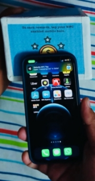
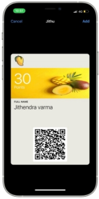
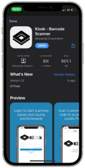
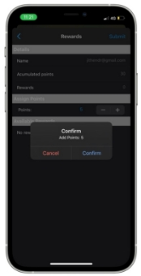

# **Creating a Customer Loyalty Program**

A customer loyalty program is what drives the customers to return the packaging material. Customers return the packaging to get rewards in return for the packaging material. 

The NFC tag containing the campaign URL will be placed behind the following image on the package. 

Fig.4.13 Rewards Tag Position

The following instructions will be placed on the cardboard box which will help the customers in the process of redeeming the rewards in return for getting the product to be reused.

Fig.4.14 Steps to redeem the rewards

There is a need for two-person involvement in redeeming the product packaging. First-person is the customer and the second one is the delivery person who takes the package for the customer.

**4.3.1 Customer**

The following are the steps to be followed by the **customer** to redeem the product. 

1. Scan the customer loyalty program NFC tag

Bring the NFC tag near the NFC reader position in your mobile phone to scan the NFC tag.

Fig.4.15 Scanning the NFC tag

1. Open the URL

Open the URL obtained from scanning the NFC tag. The following login page will appear.

Fig.4. 16 Open the URL

1. Fill in the details

Fill in the details on to the form, check the program rules, terms and conditions and the privacy policy and click on submit button.

Fig.4.17 Fill in the form details

1. Pass Generation

The following pass will be generated for the new account. By default, 30 points will be awarded for new accounts.

Fig.4.18 Pass Generation

**4.3.2 Delivery person**

The following are the steps to be followed by the **delivery person** to redeem the product. 

1. Open the Kiosk app

Open the kiosk app which is linked with a database of the customer's data.

Fig. 4.19 Open the kiosk app

1. Fill in the Details

Fill in the details on to the form, check the program rules, terms and conditions and the privacy policy and click on submit button.

Fig. 4.20 Fill in the Details

1. Scanning

This login page will be opened with the delivery persons account now click on start scanning.

Fig.4.21 Home page

1. Scan the customer QR code

Fig. 4.22 Scanning the customer QR Code

1. Assigning the reward points to customer

After scanning the customer QR code his account can be accessed by the delivery person he now can assign points to the customer based on the packaging returned by the customer. Now the customer needs to select the points to be assigned and then he should click on submit.

Fig. 4.23 Assigning Reward points

1. Confirming the rewards points assignment

After assigning the points to the customer. The delivery person needs to confirm the assignment once more such that the assignment of reward points is double verified. Once it is confirmed then the points will be reflected in the customer’s account.

Fig. 4.24 Confirming the assignment of points
