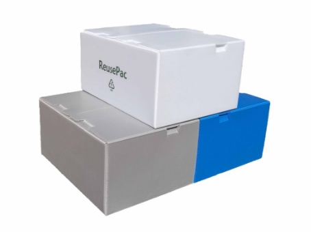
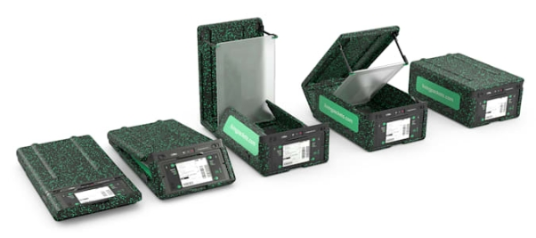
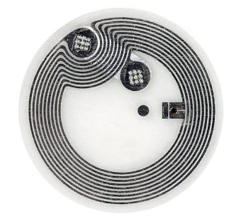
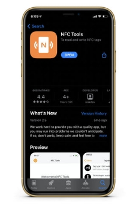
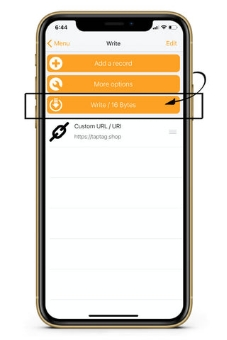
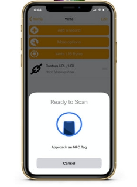
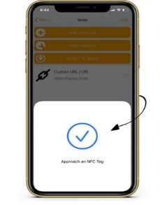
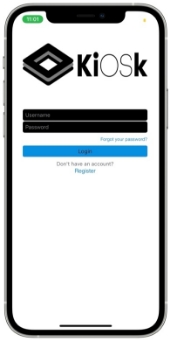
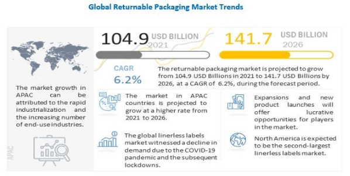

**INTELLIGENT DELIVERY SYSTEM USING NFC**

***A Socially Relevant Project-II report submitted to***

**JAWAHARLAL NEHRU TECHNOLOGICAL UNIVERSITY   ANANTAPUR, ANANTHAPURAMU**

*in partial fulfilment of the requirements for* 

*the award of the degree of*

**BACHELOR OF TECHNOLOGY**

**in**

**ELECTRONICS AND COMMUNICATION ENGINEERING**

***Submitted by***

`                                `**B SAI DIVYA	19121A0431**

`                                `**B RAJESH REDDY	19121A0432**

`                                `**B BABY SRIVIDYA	19121A0433**

`                                `**C JITHENDRA VARMA	19121A0434**

`                                `**C ACHYUTA SAI	19121A0435**

***Under the esteemed Supervision of***

**Mr. P. MADHU KUMAR, M.Tech., (Ph.D.)**

Assistant professor (SL), Department Of ECE.

Department of Electronics and Communication Engineering

SREE VIDYANIKETHAN ENGINEERING COLLEGE

**(AUTONOMOUS)**

Sree Sainath Nagar, A. Rangampet, Tirupathi - 517102.

**(2019-2023)**

18

SREE VIDYANIKETHAN ENGINEERING COLLEGE

**(AUTONOMOUS)**

**Sree Sainath Nagar, A.Rangampet - 517 102**

**VISION**

To be one of the Nation’s premier Engineering Colleges by achieving the highest order of excellence in Teaching and Research.

**MISSION**

- To foster intellectual curiosity, pursuit and dissemination of knowledge.
- To explore students’ potential through academic freedom and integrity.
- To promote technical mastery and nurture skilled professionals to face competition in ever increasing complex world.

**DEPARTMENT OF ELECTRONICS AND COMMUNICATION ENGINEERING**

**VISION**

To be a center of excellence in Electronics and Communication Engineering through teaching and research producing high quality engineering professionals with values and ethics to meet local and global demands.

**MISSION**

- The Department of Electronics and Communication Engineering is established with the cause of creating competent professionals to work in multicultural and multidisciplinary environments.
- Imparting knowledge through contemporary curriculum and striving for development of students with diverse background.
- Inspiring students and faculty members for innovative research through constant interaction with research organizations and industry to meet societal needs.
- Developing skills for enhancing employability of students through comprehensive training process.
- Imbibing ethics and values in students for effective engineering practice.

**B. Tech. (Electronics and Communication Engineering)**

**Program Educational Objectives**

After few years of graduation, the graduates of B.Tech (ECE) will be:

|**PEO1.**|Enrolled or completed higher education in the core or allied areas of electronics and communication engineering or management.|
| -: | - |
|**PEO2.**|
Successful entrepreneurial or technical career in the core or allied areas of

electronics and communication engineering.
|
|**PEO3.**|Continued to learn and to adapt to the world of constantly evolving technologies in the core or allied areas of electronics and communication engineering.|

**Program Outcomes**

On successful completion of the Program, the graduates of B.Tech. (ECE) Program will be able to:

|**PO1**|Engineering knowledge**:** Apply the knowledge of mathematics, science, engineering fundamentals, and an engineering specialization to the solution of complex engineering problems.|
| :-: | - |
|**PO2**|Problem analysis**:** Identify, formulate, research literature, and analyze complex engineering problems reaching substantiated conclusions using first principles of   mathematics, natural sciences, and engineering sciences.|
|**PO3**|Design/development of solutions**:** Design solutions for complex engineering problems and design system components or processes that meet the specified needs with appropriate consideration for the public health and safety, and the cultural, societal, and environmental considerations.|
|**PO4**|Conduct investigations of complex problems**:** Use research-based knowledge and research methods including design of experiments, analysis and interpretation of data, and synthesis of the information to provide valid conclusions.|
|**PO5**|Modern tool usage**:** Create, select, and apply appropriate techniques, resources, and modern engineering and IT tools including prediction and modelling to complex engineering activities with an understanding of the limitations.|
|**PO6**|The engineer and society: Apply reasoning informed by the contextual knowledge to assess societal, health, safety, legal and cultural issues and the consequent responsibilities relevant to the professional engineering practice.|
|**PO7**|Environment and sustainability: Understand the impact of the professional engineering solutions in societal and environmental contexts, and demonstrate the knowledge of, and need for sustainable development.|
|**PO8**|Ethics: Apply ethical principles and commit to professional ethics and responsibilities and norms of the engineering practice.|
|**PO9**|Individual and team work: Function effectively as an individual, and as a member or leader in diverse teams, and in multidisciplinary settings.|
|**PO10**|Communication: Communicate effectively on complex engineering activities with the engineering community and with society at large, such as, being able to comprehend and write effective reports and design documentation, make effective presentations, and give and receive clear instructions.|
|**PO11**|Project management and finance: Demonstrate knowledge and understanding of the engineering and management principles and apply these to one’s own work, as a member and leader in a team, to manage projects and in multidisciplinary environments.|
|**PO12**|Lifelong learning: Recognize the need for, and have the preparation and ability to engage in independent and life-long learning in the broadest context of technological change.|

**Program Specific Outcomes**

On successful completion of the Program, the graduates of B. Tech. (ECE) will be able to

|**PSO1**|Design and develop customized electronic circuits for domestic and industrial applications.|
| :- | :- |
|**PSO2**|
Use specific tools and techniques to design, analyze and synthesize wired and wireless

communication systems for desired specifications and applications.
|
|**PSO3**|
Apply suitable methods and algorithms to process and extract information from signals

and images in Radar, Satellite, Fiber optic and Mobile communication systems.
|

Department of Electronics and Communication Engineering

**SREE VIDYANIKETHAN ENGINEERING COLLEGE**

**(AUTONOMOUS)**

**Sree Sainath Nagar, A.Rangampet - 517102.**

**Certificate**

**This is to certify that the Socially Relevant Project-II Report entitled** 

**INTELLIGENT DELIVERY SYSTEM USING NFC**

`                              `**is the bonafide work done & submitted by**

`                                  `**B SAI VIDYA	 19121A0431**

`                                  `**B RAJESH REDDY	 19121A0432**

`                                  `**B BABY SRIVIDYA	 19121A0433**

`                                  `**C JITHENDRA VARMA	 19121A0434**

`                                  `**C ACHYUTA SAI	 19121A0435**

`           `in the Department of Electronics and Communication Engineering, **Sree**

`               `**Vidyanikethan Engineering College, A. Rangampet** and is submitted to **Jawaharlal**

`               `**Nehru Technological University Anantapur, Ananthapuramu** in partial fulfilment

`           `of the requirements for the award of degree of Bachelor of Technology

`           `in Electronics and Communication Engineering during 2019-2023.

|

** 

` `**Supervisor**
|
**                

` `**Head of the Department**
|
| :- | :- |
|
`    `**Mr. P MADHU KUMAR, M.Tech., (Ph.D.)**

**Assistant Professor (SL), Department Of ECE**
|
` `**Dr. N. GIREESH, M.Tech., Ph.D.,**

` `**Professor & Head of Dept. of ECE**
|
|
***   

`     `**EXAMINER-1**

`     `**Date of Submission**
|

*      **EXAMINER-2**
|

**ACKNOWLEDGEMENTS**

We are deeply indebted to the supervisor **Mr. P. MADHU KUMAR, M.Tech., (Ph.D.)** Professor of Department of Electronics and Communication Engineering for valuable guidance, constructive criticism and keen interest evinced throughout the course of our social relevant project work. We are really fortunate to associate ourselves with such an advising and helping guide in every possible way, at all stages, for the successful completion of this work.

We express our deep sense of gratitude to **Dr. N. GIREESH, M.Tech., Ph.D.,** Professor and Head of the Department of Electronic and Communication Engineering for his valuable guidance and constant encouragement given to us during this social relevant project and the course.

We express gratitude to our principal **Dr. B. M. SATISH, Ph.D.,** for supporting us in completion of our social relevant project work successfully by providing the facilities. We are pleased to express our heart full thanks to our faculty in Department of ECE of Sree Vidyanikethan Engineering College for their moral support and good wishes.

Finally, we have a notation to express our sincere thanks to friends and all those who guided, inspired and helped us in the completion of our social relevant project work.

B SAI DIVYA	19121A0431

B RAJESH REDDY	19121A0432

B BABY SRIVIDYA	19121A0433

C JITHENDRA VARMA	19121A0434

C ACHYUTA SAI	19121A0435

**ABSTRACT**

During and after the pandemic, e-commerce had a high economic boom that accelerated the expansion of online customers and different types of products sold online. It has provided customers with access to a significant variety of products from the convenience and safety of their homes. However, it also increased the amount of waste produced by the packaging materials, which ultimately go to the landfills, incinerators, and the environment. These packaging materials are both paper-based and of plastic. Every year 3-billion trees are pulped to produce 241 million tons of shipping boxes, cardboard senders, void-fill wrappers, and other paper and plastic products based on the research by forest conservation group Canopy. 

`           `So to manage these waste products, we use specific waste management processes based on the “waste hierarchy.” It is the order of priority of actions to reduce the amount of waste generated and to improve the overall waste management process. The waste hierarchy consists of 3 R’s: reduce, reuse, and recycle. So we can see that reusing a product is given more priority than recycling it. So with our design, we are trying to reuse the packaging materials with the help of NFC (Near Field Communications) tags.

`           `NFC is a popular wireless technology that allows you to transfer small amounts of data between devices close to each other. It is often used as a faster and more secure alternative to QR codes. After all, tapping an NFC tag takes less time than the conventional method of scanning a QR code. So we aim to attach an NFC tag to the packaging material, which has mainly three functions. First, to provide the details of the contents of the package. Second, to provide ease of access to payments with NFC payments. The last and most important function is to increase the reusability of the packaging material by providing it with a customer-specific ID. When the Customer returns the packaging material, this id will be considered, and some e-points will be provided to the Customer in his e-account. The Customer can use these points to order more products. These e-points will be provided based on the shape and size of the package which is being returned. Such use of NFC tags for delivery will encourage the Customer to return the packaging material thus making the economy more sustainable.
18

**CONTENTS**

|**CHAPTER NO.**|**TITLE**|**Page no.**|
| :- | :- | :- |
||**Acknowledgments**|**v**|
||**Abstract**|**vi**|
||**List of figures**|**viii**|
|**CHAPTER 1**|**INTRODUCTION**|**01**|
||
1.1 Introduction

&emsp;1.2 Motivation

&emsp;1.3 Objectives

&emsp;1.4 Scope
|
**01**

**02**

**03**

**04**
|
|**CHAPTER 2**|**LITERATURE REVIEW**|**05**|
|**CHAPTER 3**|**SYSTEM ANALYSIS**|**07**|
||
**      3.1 Existing System

`     `3.2 Proposed System
|
**07**

**12**

|
|**CHAPTER 4**|**IMPLEMENTATION**|**15**|
||`    `4.1 Selecting the package material|**15**|
||`    `4.2 Programing specific tasks for NFC|**17**|
||`    `4.3 Creating a customer loyalty program|**24**|
|**CHAPTER 5**|**FUTURE SCOPE**|**32**|
||**CONCLUSION**|**33**|
||**REFERENCES**|**34**|

**LIST OF FIGURES**

|**Figure No.**|`                    `**Description**|`               `**Page No.**|
| :- | :- | :- |
|3.1|`         `Boox Boxes|08|
|3.2|`       `Reusepac Boxes|09|
|3.3|`       `Living Packets|11|
|4.1|`       `Polypropelene Boxes|16|
|4.2|`       `Polypropelene|16|
|4.3|`       `NFC tags|17|
|4.4|`       `Installing an NFC writer app|19|
|4.5|`       `Open the NFC tools app|20|
|4.6|`       `Adding a record|20|
|4.7|`       `Adding the required records |21|
|4.8|`       `Adding the custom URL|22|
|4.9|`       `Writing the record|22|
|4.10|`       `Scanning the NFC tag|23|
|4.11|`       `Finishing the task|23|
|4.12|`       `NFC tag position|24|
|4.13|`       `Rewards tag position|25|
|4.14|`       `Steps to redeem the reward|25|
|4.15|`       `Scanning the NFC tag|26|
|4.16 |`       `Open the URL|26|
|4.17|`       `Fill the form details|27|
|4.18|`       `Pass generation|27|
|4.19|`       `Open the Kiosk app|28|
|4.20|`       `Fill in the details|28|
|4.21|`       `Home page |29|
|4.22|`       `Scanning the customer QR code|29|
|4.23|`       `Assigning reward points|30|
|4.24|`       `Confirming the assignment of points|31|

# **Chapter 1**
# **Introduction**

## **1.1 Introduction**

Online shopping, a form of electronic commerce (e-commerce), is a type of business where buyers and sellers interact electronically (using the Internet channel) for the exchange of goods and services and payments of the transaction. E-commerce offers positive environmental effects, for example, greenhouse gas emission reduction due to reduced travelling needs by individual consumers, and other energy use in traditional brick-and-mortar shops. 

However, online shopping is not entirely free from negative environmental impacts. Packaging waste from e-commerce is one of such concerns. A typical e-commerce parcel may use up to seven types of packaging materials: paper bills, envelopes, cardboard boxes, plastic bags, woven bags, tape, and buffer materials (bubble wrap, Styrofoam). Environmental impacts of online shopping can be categorized into first-order (information and communication technology equipment usage), second-order (changing of processes and markets affecting the logistics system for product fulfilment and delivery), and third-order (rebound) effects. 

In order to transform e-commerce into Green commerce, companies need to invest in packaging innovation and sustainable supply chain mechanisms including reverse logistics systems to promote reuse and recycling, while consumers also need to display sustainable consumption behaviour. All this is possible with the help of using a new delivery system which takes all the pros and cons of the existing system into account and tries to modify its flaws to make it into a more feasible system. This new proposed system can be called an intelligent delivery system because it takes the help of NFC tags to make the existing delivery system a more sustainable one.

##
## **1.2 Motivation**

Let us take into consideration the case of Amazon a major e-commerce platform of the era. A recent study by Oceana found that Amazon generated 465 million pounds of plastic packaging waste in 2019. The number of air pillows alone could circle the globe 500 times. The environmental group further estimated that up to 22.44 million pounds of Amazon’s plastic packaging ended up in the world’s freshwater and marine ecosystems as pollution in the same year which is roughly equivalent to a delivery van’s worth of plastic being dumped into major rivers, lakes, and the oceans every 70 minutes.

Thus we can see that the amount of plastic waste generated by the company is staggering and growing at a frightening rate this study also found that the plastic packaging and waste generated by Amazon’s packages are mostly destined not for recycling, but for the landfill, incinerators, or the environment including, unfortunately, our waterways and sea, where plastic can harm marine life. Now, this is the case of a single e-commerce platform there are lots of other e-commerce platforms in the market which also produce e-commerce waste. When all this waste is taken into consideration. Since 2010, the volume of e-waste generated globally has been steadily rising. By 2019, approximately 53.6 million metric tons were produced. This was an increase of 44.4 million metric tons in just five years. Of this, just 17.4 per cent was documented to be collected and properly recycled. 

The global e-commerce plastic packaging market was valued at USD 10.26 billion in 2019, and it is expected to reach USD 21.78 billion by 2025. Also with the increase in packaging market the packaging materials also increased. Even for the packaging that can be recycled, there is no substitute for cutting down on waste in the first place. The overall recycling rate for materials, including paper, glass, and plastics, was about 32 percent in 2018, according to the Environmental Protection Agency. Up to 40 percent of world population don’t have access to receptacles for their recyclables, according to a 2016 study. In more rural areas, people might need to drop off their materials at recycling facilities, which makes it a rather complicated process. So to tackle with this e-commerce waste there is a need for a new system in the market. This is our main motivation behind our project to tackle this e-commerce waste.

3. ## **Objectives**

The following are the main objectives of the intelligent delivery system taken in order to achieve a sustainable e-commerce waste management process. 

1. **Reduce e-commerce wastage** 

The waste management hierarchy places top priority on reducing or preventing as much waste generation as possible. In our case to stop e-commerce waste generation we need to decrease the usage of e-commerce as much as possible. The idea is to maximise efficiency and prevent the unnecessary consumption of resources through steps such as:

- Order materials that come with the least packaging or require the fewest resources to refine.
- Avoid buying a small inventory of goods.
- Order goods on prime days like Monday for amazon, to decrease the amount of packaging.

If these businesses can’t reduce or prevent waste, you can prepare them for reuse.

1. **Reuse e-commerce wastage**

Preparing materials for reuse in their original form is the second-best approach to waste management. Aside from reducing your landfill impact, reusing e-commerce waste also allows your business to avoid spending on new goods or virgin materials or paying a provider to dispose of your waste for you. 

For example, e-commerce businesses can use these measures to prepare common items for reuse: 

- Using reusable cardboard boxes which are made up of multi-layered paper structure. 
- Reusing bubble wraps, cushions and other packaging materials.
- Donating or selling used boxes, tapes and other e-commerce waste products.

When these packaging materials are no longer reusable the time comes for the to be recycled.

1. **Recycle e-commerce wastage**

Recycling involves processing materials that would otherwise be sent to landfills and turning them into new products. It’s the third step of the waste management hierarchy because of the extra energy and resources that go into creating a new product. For instance, scrap card boxes can be recycled, but the process requires water and electricity to transform them into pristine new packaging products.
##
3. ## **Scope**

### **1.4.1 Customers**
- A convenient method to order products such as household appliances, and groceries online from e-commerce.
- Conveniently using the products ordered and reusing the packaging.
- If the packaging is not reusable returning, it back to the delivery partner using NFC. 
- Ensuring reliable customer service for customer satisfaction.
- An innovative platform for recycling e-commerce wastage.
  2. ### **System**
- The System being a new concept would be useful for conducting direct recycling $ reusing between customers and owners. 
- Customer satisfaction would result in building goodwill and reputation in market to increase reliability.
- This system would also improve the sustainability of nature by removing the waste.
- Employing better ways for customer satisfaction and customer retention through quality services and efficient consumer grievance system through feedback. 
- This system could be further adapted to all the goods delivery like buying the day-to-day requirements from a pantry shop.

# **Chapter 2**
# **Literature Review**
##
## **2.1 Literature Review Table**

Table 2.1  Literature Review

|||** ||
| :- | :- | :- | :- |
|
Jasmin Malik Chua

2021
|E-Commerce Waste|
Vox.com

[Online] 
|Amazon generated 465 million pounds of plastic packaging waste in 2019. The number of air pillows alone could circle the globe 500 times. The environmental group further estimated that up to 22.44 million pounds of Amazon’s plastic packaging ended up in the world’s freshwater and marine ecosystems as pollution in the same year.|
|
K.Chueamuangphan, P. Kashyap,

C. Visvanathan

2020
|E-Commerce Waste|Packaging Waste from E-Commerce: Consumers’ Awareness and Concern|A typical e-commerce parcel may use up to seven types of packaging materials: paper bills, envelopes, cardboard boxes, plastic bags, woven bags, tape, and buffer materials (bubble wrap, Styrofoam).|
|
Seahive

` `[Online] 
|E-commerce Waste|Seahive.com|The global e-commerce plastic packaging market was valued at USD 10.26 billion in 2019, and it is expected to reach USD 21.78 billion by 2025.|
|
Ian Tiseo

2021
|E-commerce Waste|Annual e-commerce plastic packaging consumption 2019-2025|
The global e-commerce industry used approximately 2.1 billion pounds of plastic packaging in 2019. It is projected that e-commerce plastic packaging use will continue to grow in the coming years, reaching an estimated 4.5 billion pounds by 2025. In 2019, e-commerce plastic packaging waste was estimated at more than one billion kilograms worldwide.

|

|
Calvin Wankhede

2022 
|NFC|
Androidauthority.com

[Online] 
|NFC, or near field communication, is a popular wireless technology that allows you to transfer data between two devices that are in close proximity to each other. It is often used as a faster and more secure alternative to QR codes for other short-range applications like mobile payments.|
| :-: | :-: | :-: | - |
|
Nathan Chandler

2021
|NFC |
Howstuffworks.com

[Online] 
|NFC tags are passive devices, drawing power from the device that reads them through magnetic induction. When the reader gets close enough, it energizes the tag and transfers the data.|
|
Wei Wei

2016
|NFC|Intelligent express delivery and transceiver system design based on NFC technology|NFC in very close distance of communication is often referred to as close to matching system, nearly matching system scope is usually less than 10 cm, which means that the label must be near the reader or installed on the reader.|
|
Wikipedia

[Online]
|NFC|Wikipedia.com|NFC is a set of short-range wireless technologies, typically requiring a separation of 10 cm or less. NFC operates at 13.56 MHz on ISO/IEC 18000-3 air interface and at rates ranging from 106 kbit/s to 424 kbit/s.|
|
Vedat Coskun Busra Ozdenizci Kerem Ok

2013 
|NFC |A Survey on Near Field Communication (NFC) Technology|
NFC industry has a new emerging business environment opportunities and a large value chain including several industries and organizations such as mobile network operators, banking and payment services, semiconductor producers and electronic appliances, software developers, and other 

merchants including transport operators and retailers. 

|
|

Janghoon Park

2015
|NFC|Fabrication of Electrodes and Near-Field Communication Tags |NFC are fabricated using Ag and Cu using Flexible Printed Circuit Boards (FPCBs) printing method|
#
#
# **Chapter 3**
# **System Analysis**
##
## **3.1 Existing System**

### **3.1.1 Boox. eco**
Reusable packaging company Boox aims to be part of a greater movement to make shipping more circular and sustainable. The Petaluma, California-based company provides its reusable plastic Boox Boxes and nylon or polyester Bags as a service to companies that want an option to reduce shipping-related waste.
##
Packaging waste versus emissions

Normal reusable packaging solutions are heavier than their single-use cardboard or plastic counterparts, which may increase emissions for transportation. This is a major argument against reusable packaging for shipping. It’s hard to make a mailer bag lighter, cheaper and sturdier than those made of plastic, but the world is getting littered with plastic. 

Boox's Bags are heavier than plastic mailers, so their associated emissions for transport are higher. However, they could be used “hundreds of times, easily,” which could cut down on plastic waste. A life-cycle analysis done by a third party found that for the same sized box, Boox’s are 44% lighter than typical cardboard ones. That would result in lower transportation-related emissions. Including the return trip, the impact of using a Boox box 10 times is 70% lower than using 10 cardboard boxes, according to the analysis.

But reusing shipping boxes and bags relies largely on the actions of consumers. For it to be cost-effective and environmentally sustainable, consumers are responsible for returning their boxes and bags at one of Boox’s 5,000 to 6,000 partner drop-off locations.

Consumer behaviour, cost and loyalty

There is a need to create a way for consumers to be able to participate in the service. It has to be convenient, it has to be cost-effective for everyone involved, and it can’t be too far outside of what you do every day. Boox boxes could be reused and refurbished upward of 12 times, and the bags could be reused hundreds of times. But it would require consumers to return them, which can be a challenge. 

Fig. 3.1 Boox Boxes

Boox’s overall return rate is estimated to be between 20% and 30%. For some brands, it’s higher than 65% or 75%, depending on how the brand educates its customers. The return rate is “very clearly lined up” with how much brands take time to educate their customers about their reasons for switching and how to return the boxes or bags. 

Some companies have slim margins, strict budgets or shareholders who would not allow for a switch to more sustainable packaging if it costs more. The Boox website says it costs 40 cents to $1.40 per shipment, depending on the dimensions. Boox boxes are often less expensive than cardboard, about the same or up to 3% to 5% more costly. “In many cases the Boox boxes are not only paying for themselves, but they’re generating revenue for its clients via retention and loyalty.”

Shipping in reusable containers can create higher retention rates and brand loyalty. Boox sometimes gets calls about which brands it works with, and those consumers will then purchase from those brands instead of competitors to avoid the packaging waste.
###
### **3.1.2 Reusepac.com**

Reuse Pac products cover innovative reusable boxes, reusable tote boxes, bulk containers and homeless shelters. They are made of the most healthy polypropylene (PP), with the simplest assembly for boxes, zero waste solutions, reusable for 100 times, and 100% recyclable to the end of life. Reuse Pac solves the problem of 100 billion cardboard boxes made and used in the US alone. Cardboard boxes are composable but quite harmful to the environment. Recycling cardboard is not quite Eco friendly as well. Reuse Pac is the paradigm of sustainable packaging for all business sectors and consumers, a paradigm for a handy and tangible solution to fight climate change. LCA study indicates that Reuse Pac saves 60%-80% money, 82% energy, 95% municipal solid Waste, 80% water, reducing 85 % CO2 carbon footprint, and reverses deforestation. Reuse Pac's innovative designs allow only one die-cut process for productions, with no clips, glues, or welds. 

Fig. 3.2 Reusepac Boxes

Reuse Pac solves the problem of 100 billion cardboard boxes made and used in the US along. 600 billion cardboard boxes are produced and used annually in the world, consuming a gigantic amount of natural resources, water, trees, petro, energy, labour etc., emitting a large amount of carbon and pollution to air, water and soil. Even recycling cardboard is too arduous to be Eco friendly. Cardboard boxes are composable but quite harmful to the environment. 30% of the municipal solid waste is from cardboard, emitting methane gas during decomposition. Reuse Pac suppled innovations on boxes never before seen in over 100 years, with the simplest assembly, disassembly, and production and at low costs. Our reusable boxes aim to be at scale with broad applications to businesses, supply chains, eCommerce, and consumers. A real handy tangible solution set to be the paradigm in circularity with impact.
### **3.1.3 Livingpackets.com**
Living Packets is one step closer to making the traditional cardboard box redundant. Last year, the start-up announced a sustainable and re-usable replacement called The Box. It was made from recyclable expanded polypropylene and featured an E Ink display instead of a single-use delivery label. Since then, the company has unveiled a second-generation model that is now starting to roll off the production line. Today, it’s announcing the first pilot that will use this upgraded box.

Living Packets says the pilot has three basic purposes. The first, unsurprisingly, is to successfully weave its boxes into the existing delivery pipeline. The second is to prove that its second-generation box can safely transport expensive items. Finally, Living Packets wants to see how customers react to the packaging, and whether they would like shops to adopt it full-time.

There are many advantages to using the box. The second-generation model has an integrated camera, for instance, that allows both the retailer and customers to check whether the order has been damaged. It’s also equipped with a variety of sensors that measure the temperature and pressure inside the case, as well as the pressure, shocks and motion that the goods inside are being subjected to. If you’re ordering something delicate, or that can be damaged through excessive heat or knocks, this could prove invaluable. In theory, a delivery driver could be notified mid-route that the package isn’t secure and should be moved to another place inside their vehicle.

In addition, the second-gen box comes with a speaker and microphone. That means the receiver and delivery driver can communicate with one another without being face to face. Living Packets increased the size of the E Ink display and added an electrical locking system that stops strangers from opening it. (The recipient uses a companion app to safely unlock it.) Like a traditional cardboard box, it can also be folded down to save space in both warehouses and recipients’ homes. In its unfolded form, the box measures 495x360x180mm, with an internal capacity of 32 liters. Once it’s broken down, the height is reduced from 180 to 10mm.

Fig.3.3 Living Packets

Clearly, a cardboard box is cheaper to produce. Living Packets believes that its replacement can be cost-effective, though. For one, the box can last up to 1,000 trips before it needs to be repaired or recycled. Companies should spend less money on damaged orders, too — a costly process which involves sending out a replacement item and financing a follow-up delivery. Living Packets plans to make money by charging retailers a small service fee for each box delivery. 

A big problem, though, is the retrieval of these boxes. Nobody wants to leave their home just to return a reusable box, for instance. On its website, Living Packets explains that its ultimate goal is to create a “circular economy.” You could use the box for a future return, for instance. Or, through the Living Packets app, use the packaging for any regular delivery — a donation to a charity, perhaps, or sending a birthday present to a loved one. Alternatively, users will get some kind of “reward” if they make their box “available to everybody.” They’ll also be rewarded if they return the packaging to an applicable store or give it to a nearby merchant that needs more boxes for their own deliveries. Finally, logistics partners will earn cash if they agree to pick up the box from your home.

Living Packets has a long way to go. It’s tested an early version of the box with other companies including Cdiscount and Chronopost. If enough retailers jump on board, Living Packets could help society move away from boxes, packing tape and sticky shipping labels that are often thrown out after a single-use.
## **3.2 Proposed System**
Intelligent Delivery System uses a whole new system to abruptly change the existing delivery system whether it be with respect to e-commerce or products from retailers. This delivery system took all the flaws of the traditional delivery system and solved them to make the existing delivery system a more sustainable one. To reuse the packaging as economically as possible. So this intelligent delivery system works on the three main principles to solve the traditional problem.

- Using reusable packaging for shipping the products.
- Making the packaging easy to deliver.
- Making the products to be returnable with a customer loyalty rewards program.

Using reusable packaging for shipping the products

Reusable packaging is packaging that is used multiple times, often for the purpose of transporting products. It is typically designed for durability, ease of use, ease of cleaning, and ease of repair and is ideally collapsible or nestable. All of those characteristics make it easy to return to the original user, which can utilize it over and over again.

For small businesses, reusable packaging may consist of industrial-size containers, such as drums, or smaller, consumer-size packages, such as kegs or plastic bottles. For consumers, reusable packaging can be opportunistic in nature, such as reutilizing cardboard boxes, water jugs, or glass bottles.

`	`Traditional e-commerce packaging uses single-layer cardboard boxes. It is a box made with one layer of corrugated cardboard. Single-walled boxes are often used in e-commerce shipping as they are lighter and cheaper than double-walled boxes. But it also makes it non-reusable as they get damaged due to the delivery process. So, we are aiming to use triple-walled boxes and other alternatives which can be reused for product delivery. The following are the top alternatives for traditional packaging.

1. Using paper bubble wraps.
1. Using Paper tapes.
1. Using Corn-starch Packaging.
1. Biodegradable foam chips (Packaging Peanuts).
1. Using sustainable and recycled plastics.

These alternatives are biodegradable alternatives to traditional packaging delivery systems. But we are trying to implement a more strong, more durable and cost-effective alternative for traditional packaging using recycled plastics packaging.

Making the packaging ease to deliver

The traditional packaging delivery uses paper receipts, invoices, labels to store the information of the products details, contact information, payment information, and the delivery address. These receipts are also made from paper which might possess an environmental threat because to make these receipts alone we are cutting many trees. This is one of the major problem posed by the traditional delivery system.

Also there is an security threat of information by third person who has hands on the package because he might try to steal the information which might be confidential and personal to the customer. This open access to information about the packaging can be a major security threat in the day today usage of e-commerce platforms to order some personal products for usage.

`	`Also the traditional packaging delivery system lacks the ease of delivery to deliver the products. Normally to deliver the products the delivery person needs to search his catalogue for the details of the product along with the customer details this is a time consuming process. let us take the case of a delivery person who needs to deliver a toothbrush which is ordered by the customer through an e-commerce platform. To deliver this toothbrush the delivery person has to check his catalogue for the customer details who ordered the product. This makes the delivery process  more complicated.

`	`To address all the above-addressed issues we are adding NFC tags to the packaging boxes. These NFC tags can store information.

1. Instead of papers which are non-reusable we can use NFC tags as storage for receipts which are reusable.
1. NFC tags are more secure than paper receipts because they can be encoded to be opened by specific customers and delivery persons thus solving the issue of security threats.
1. NFC tags can also make the delivery process very easy. We can add the details so that the delivery person can just tap his mobile on the NFC tag on the box to get all the details of the product including the contact, and payment information thus making the delivery process easy.

Making the product returnable using a customer loyalty rewards program. 

In the normal delivery system if the idea of reusing a product is to be implemented then we have to answer the specific question of the customer that is 

“Why should I return the package?”

So to answer this question we created a customer loyalty program. By definition, a customer loyalty program is a marketing approach that recognizes and rewards customers who purchase or engage with a brand on a recurring basis. A company may give points or perks, and graduate customers to higher levels of loyalty the more they buy. These incentives and specific benefits often result in the customer becoming a more regular consumer or the ideal — a brand promoter. Benefits may involve free merchandise, rewards, coupons, or insider perks like early access to new products. 

A customer loyalty program is what drives the customers to return the packaging. Such that if the customer returns the product he will be awarded some perks i.e., points. These points can be redeemed for brand vouchers or some other exciting deals. Such that both the customer and e-commerce platform can be benefitted from this program. Customers is benefited from the rewards obtained from the program. The E-Commerce platform is benefitted by reducing the usage of new packaging materials.
# **Chapter  4**
# **Implementation**

Project implementation is the process of putting a project plan into action to produce the deliverables, otherwise known as the products or services, for clients or stakeholders. It takes place after the planning phase, during which a team determines the key objectives for the project, as well as the timeline and budget. Implementation involves coordinating resources and measuring performance to ensure the project remains within its expected scope and budget. It also involves handling any unforeseen issues in a way that keeps a project running smoothly.

There are three faces of implementation in the system.

1) Selecting the packaging material.
1) Programing specific tasks for each NFC.
1) Creating the customer loyalty program.
## **4.1 Selecting the packaging material**

The packaging material selected should be reusable. Reusable packaging is manufactured of durable materials and is specifically designed for multiple trips and extended life. A reusable package or container is designed for reuse without impairment of its protective function. The term returnable is sometimes used interchangeably but it can also include returning packages or components for other than reuse: recycling, disposal, incineration, etc. Typically, the materials used to make returnable packaging include steel, wood, polypropylene sheets or other plastic materials. Reusability of packaging is an important consideration of the environmental credo of “reduce, reuse, and recycle”. It is also important to the movement toward more sustainable packaging.

So bio-pp is a bio alternative of polypropylene. Bio-based polypropylene is a polymer manufactured from natural materials such as corn, sugar cane, vegetable oil, and some other biomass. The properties of bio-based polypropylene are similar to synthetic polypropylene. This polymer is used in injection moulding, textiles, film, and other applications.

Fig.4.1 Polypropylene Boxes

Polypropylene (PP), also known as polypropene, is a thermoplastic polymer used in a wide variety of applications. It is produced via chain-growth polymerization from the monomer propylene.

Fig.4.2 Polypropene

Polypropylene belongs to the group of polyolefins and is partially crystalline and non-polar. Its properties are similar to polyethylene, but it is slightly harder and more heat resistant. It is a white, mechanically rugged material and has a high chemical resistance. Polypropylene is the second-most widely produced commodity plastic (after polyethylene). In 2019, the global market for polypropylene was worth $126.03 billion. Revenues are expected to exceed US$145 billion by 2019. The sales of this material are forecast to grow at a rate of 5.8% per year until 2021. 

##
## **4.2 Programming specific tasks for NFC**

NFC is a set of short-range wireless technologies, typically requiring a separation of 10 cm or less. NFC operates at 13.56 MHz on ISO/IEC 18000-3 air interface and at rates ranging from 106 kbit/s to 424 kbit/s. NFC always involves an initiator and a target; the initiator actively generates an RF field that can power a passive target. This enables NFC targets to take very simple form factors such as unpowered tags, stickers, key fobs, or cards. NFC peer-to-peer communication is possible, provided both devices are powered. 

NFC tags contain data and are typically read-only, but may be writable. They can be custom-encoded by their manufacturers or use NFC Forum specifications. The tags can securely store personal data such as debit and credit card information, loyalty program data, PINs and networking contacts, among other information. The NFC Forum defines four types of tags that provide different communication speeds and capabilities in terms of reconfigurability, memory, security, data retention and write endurance.

Fig.4.3 NFC Tags

As with proximity card technology, NFC uses inductive coupling between two nearby loop antennas effectively forming an air-core transformer. Because the distances involved are tiny compared to the wavelength of electromagnetic radiation (radio waves) of that frequency (about 22 meters), the interaction is described as a near field. Only an alternating magnetic field is involved so that almost no power is actually radiated in the form of radio waves (which are electromagnetic waves, also involving an oscillating electric field); that essentially prevents interference between such devices and any radio communications at the same frequency or with other NFC devices much beyond its intended range. They operate within the globally available and unlicensed radio frequency ISM band of 13.56 MHz. Most of the RF energy is concentrated in the ±7 kHz bandwidth allocated for that band, but the emission's spectral width can be as wide as 1.8 MHz in order to support high data rates.

NFC allows you to share small payloads of data between an NFC tag and an Android-powered device, or between two Android-powered devices. The data stored in the tag can also be written in a variety of formats, but many of the Android framework APIs are based around an NFC Forum standard called NDEF (NFC Data Exchange Format).

Android-powered devices with NFC simultaneously support three main modes of operation:

1. **Reader/writer mode**, allowing the NFC device to read and/or write passive NFC tags and stickers.
1. **P2P mode**, allows the NFC device to exchange data with other NFC peers; this operation mode is used by Android Beam.
1. **Card emulation mode**, allowing the NFC device itself to act as an NFC card. The emulated NFC card can then be accessed by an external NFC reader, such as an NFC point-of-sale terminal.

In our system, we are using P2P mode to transfer the information between NFC peers that is the customer and retailer. The following are the steps involved in writing specific information onto the tag.

4.2.1 Getting a tag

We bought the following NFC tag for the delivery system based on the specifications and requirements (RapidRadio 13.56 MHz ISO 14443A: NFC Type 2 NTAG213 HF RFID NFC NTag Sticker)

Specifications:

- Operating Frequency: 13.56 MHz High Frequency (HF)
- Material: Label
- Standards/Protocols: ISO 14443A : NFC Type 2
- Integrated Circuit: NTAG213
- Applications: Payments | Wireless Pairing | Access Control | Customer Loyalty.

2. Install an NFC Tag writer app

There are a number of free apps that can write NFC tags on Google Play. A few are Trigger, NFC Tools, and NFC TagWriter by NXP. We are using the NFC tools app for writing the NDEF encoding onto the NFC chip.

Fig.4.4 Installing a NFC Writer app

2. Open the NFC Tools app

After opening the app, you will be greeted with this home page. Click "Write" to move on to the next step. 

Fig.4.5 Open the NFC tools app

2. Add a record

Here, you will see a page with three options. Click the first option, **"Add A Record,"** to move on to step 5.

Fig.4.6 Adding a record

2. Adding the required records

This step greets you with many options to code into your Tap Tag. The recommended option is to click **"Custom URL/URI."** Move on to the next step.

Fig.4.7 Adding the required records

2. Adding the custom URL

After clicking **"Custom URL/URI",** the app will bring you to this simple page. Just type in your www. or copy/paste your web link. Click **"OK"** in the top right corner when you are done.

*Fig.4.*8 Adding the custom URL

2. Writing the information onto the tag

After clicking **"OK",** you will be brought back to this page. This time your Custom URL will be added. You will also notice the app tells you the amount of space your link takes up, in this case, 16 Bytes. Click **"Write"** to be prompted with an NFC **"Ready to Scan"** message.

Fig.4.9 Writing the record

2. Scanning the tag

Now your smartphone is looking for an NFC tag to encode. For iPhone, hold the top of your phone within 1 inch of Tap Tag while this message is up. For android, place the middle of the phone onto Tap Tag.  Your smartphone will make a sound and/or vibrate when your NFC tag is officially encoded, which takes less than one second. 

Fig. 4.10  Scanning the NFC Tag

2. Finishing the task

This checkmark symbolizes that your NFC chip is programmed! 

Fig.4.11 Finishing the Task

That is how we programmed the NFC tag to perform all the tasks. For our delivery system, we used four NFC Tags each one having different functionalities.

- Product Information
- Payment 
- Contact Information
- Customer Loyalty Program

These tags are placed behind their respective pictures each describing the content of the NFC tag behind them.

Fig. 4.12 NFC Tag Position

## **4.3 Creating a Customer Loyalty Program**

A customer loyalty program is what drives the customers to return the packaging material. Customers return the packaging to get rewards in return for the packaging material. 

The NFC tag containing the campaign URL will be placed behind the following image on the package. 

Fig.4.13 Rewards Tag Position

The following instructions will be placed on the cardboard box which will help the customers in the process of redeeming the rewards in return for getting the product to be reused.

Fig.4.14 Steps to redeem the rewards

There is a need for two-person involvement in redeeming the product packaging. First-person is the customer and the second one is the delivery person who takes the package for the customer.

**4.3.1 Customer**

The following are the steps to be followed by the **customer** to redeem the product. 

1. Scan the customer loyalty program NFC tag

Bring the NFC tag near the NFC reader position in your mobile phone to scan the NFC tag.

Fig.4.15 Scanning the NFC tag

1. Open the URL

Open the URL obtained from scanning the NFC tag. The following login page will appear.

Fig.4. 16 Open the URL

1. Fill in the details

Fill in the details on to the form, check the program rules, terms and conditions and the privacy policy and click on submit button.

Fig.4.17 Fill in the form details

1. Pass Generation

The following pass will be generated for the new account. By default, 30 points will be awarded for new accounts.

Fig.4.18 Pass Generation

**4.3.2 Delivery person**

The following are the steps to be followed by the **delivery person** to redeem the product. 

1. Open the Kiosk app

Open the kiosk app which is linked with a database of the customer's data.

Fig. 4.19 Open the kiosk app

1. Fill in the Details

Fill in the details on to the form, check the program rules, terms and conditions and the privacy policy and click on submit button.

Fig. 4.20 Fill in the Details

1. Scanning

This login page will be opened with the delivery persons account now click on start scanning.

Fig.4.21 Home page

1. Scan the customer QR code

Fig. 4.22 Scanning the customer QR Code

1. Assigning the reward points to customer

After scanning the customer QR code his account can be accessed by the delivery person he now can assign points to the customer based on the packaging returned by the customer. Now the customer needs to select the points to be assigned and then he should click on submit.

Fig. 4.23 Assigning Reward points

1. Confirming the rewards points assignment

After assigning the points to the customer. The delivery person needs to confirm the assignment once more such that the assignment of reward points is double verified. Once it is confirmed then the points will be reflected in the customer’s account.

Fig. 4.24 Confirming the assignment of points

# **Chapter 5**
# **Future Scope**

We are aiming to use this Intelligent delivery system not only for the cardboard box delivery of e-commerce but also to all the e-commerce store order delivery. This method can make the normal delivery of the orders to be more sustainable and eco-friendlier. To further increase the scope of this system we can introduce an option to customers on the e-commerce platform to opt to either reusable packaging or non-reusable packaging based on their needs. Such a method of asking the customer to consent to opt for reusable and non-reusable packaging can help in decreasing the materials that are required to make the reusable packaging.

This Intelligent Delivery system can be further adapted to normal day to day shopping like buying groceries from the supermarket. While buying goods from the supermarket we can use reusable packaging instead of traditional plastic packaging. Such that we can make the environment more eco-friendly. The global returnable packaging market size is projected to grow from USD 104.9 billion in 2021 to USD 141.7 billion by 2026, at a CAGR of 6.2% from 2021 to 2026. The returnable packaging market is expected to witness significant growth in the coming years due to its increased demand across the food & beverage, and automotive industries.  So there is a high future scope for this type of delivery system involving the returnable packaging.

# **Conclusion**

The packaging industry has scarcely changed the structure of folding boxes since the 19th century even though the recent growth of e-commerce has considerably increased packaging usage and raised the need for effective solutions to the ensuing environmental problems. Packaging evolved substantially by the effect of the production of new materials until the 1990s. At present, however, it has reached a standstill owing to the need for effective ways of reducing costs and environmental impacts. Unlocking this situation will call for new design paradigms to be built.

To tackle this e-commerce waste generation issue we proposed an intelligent delivery system using NFC. This delivery system tackles all the flaws of a traditional system like the usage of non-reusable packaging for delivery, ease of delivery and privacy of information by implementing the usage of NFC (Near Field Communication) Tags for this process. Thus making this new process of the delivery system more economic, eco-friendly and sustainable when compared to the traditional delivery system.

**

**REFERENCES**

[1] DEBOONME, A. (2016), “Need to weigh-up the costs of e-commerce, not just the benefits” *International Journal of Social Science & Interdisciplinary Research,* vol. 1, no. 9, pp. 59-74. 

[2] N. H. V. E. H. Panneerselvam Peramaiyan, “Indian farmers' experience with and perceptions of organic farming,” *Renewable Agriculture and Food Systems,* pp. 1-14. 

[3] M. N. Parveen Kumar, “E-Commerce in India: A SWOT analysis,” *Indian Journal of Applied Research,* vol. 3, no. 7, pp. 4-6. 

[4] A. T. Gopi Krishna Suvanam, “Imbalances Created because of Structured Products in Indian Equity markets,” pp. 1-.3. 

[5] S. Yadav, “STOCK MARKET VOLATILITY - A STUDY OF INDIAN STOCK MARKET,” *| IC Value 80.2,* vol. 4, no. 6, pp. 629-632. 

[6] D. Bhowmik, “STOCK MARKET VOLATILITY: AN EVALUATION,” *International Journal of Scientific and Research Publications,* vol. 3, no. 10, pp. 3-13. 

[7] D. R. G. A. Ms. Nidhi Rajendra Bisen, “A STUDY ON EXISTING LITERATURE OF E- MARKET,” *International Journal of Management Studies,* vol. 3, no. 1, pp. 106-111. 

[8] P. Klemperer, “Auction Theory,” *Journal of Economic Surveys,* vol. 13, no. 3, pp. 227- 286. 

[9] D. R. A. S. Axel Ockenfels, “ONLINE AUCTIONS,” *NBER WORKING PAPER SERIES,* pp. 3-69. 

[10] C. Ren, “Research and Design of Online Auction System Based on the Campus Network Using UML,” *Second Pacific-Asia Conference on Web Mining and Web-based Application.* 

