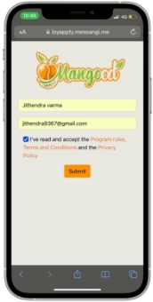
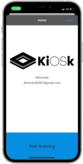
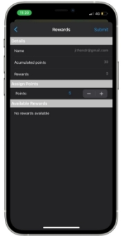

# Product Delivery Using NFC

Intelligent Delivery System uses a whole new system to abruptly change the existing delivery system whether it be with respect to e-commerce or products from retailers. This delivery system took all the flaws of the traditional delivery system and solved them to make the existing delivery system a more sustainable one. To reuse the packaging as economically as possible. So this intelligent delivery system works on the three main principles to solve the traditional problem.

- Using reusable packaging for shipping the products.
- Making the packaging easy to deliver.
- Making the products to be returnable with a customer loyalty rewards program.

## Using reusable packaging for shipping the products

Reusable packaging is packaging that is used multiple times, often for the purpose of transporting products. It is typically designed for durability, ease of use, ease of cleaning, and ease of repair and is ideally collapsible or nestable. All of those characteristics make it easy to return to the original user, which can utilize it over and over again. For small businesses, reusable packaging may consist of industrial-size containers, such as drums, or smaller, consumer-size packages, such as kegs or plastic bottles. For consumers, reusable packaging can be opportunistic in nature, such as reutilizing cardboard boxes, water jugs, or glass bottles.

Traditional e-commerce packaging uses single-layer cardboard boxes. It is a box made with one layer of corrugated cardboard. Single-walled boxes are often used in e-commerce shipping as they are lighter and cheaper than double-walled boxes. But it also makes it non-reusable as they get damaged due to the delivery process. So, we are aiming to use triple-walled boxes and other alternatives which can be reused for product delivery. The following are the top alternatives for traditional packaging.

1. Using paper bubble wraps.
1. Using Paper tapes.
1. Using Corn-starch Packaging.
1. Biodegradable foam chips (Packaging Peanuts).
1. Using sustainable and recycled plastics.

These alternatives are biodegradable alternatives to traditional packaging delivery systems. But we are trying to implement a more strong, more durable and cost-effective alternative for traditional packaging using recycled plastics packaging.

## Making the packaging ease to deliver

The traditional packaging delivery uses paper receipts, invoices, labels to store the information of the products details, contact information, payment information, and the delivery address. These receipts are also made from paper which might possess an environmental threat because to make these receipts alone we are cutting many trees. This is one of the major problem posed by the traditional delivery system. Also there is an security threat of information by third person who has hands on the package because he might try to steal the information which might be confidential and personal to the customer. This open access to information about the packaging can be a major security threat in the day today usage of e-commerce platforms to order some personal products for usage.

Also the traditional packaging delivery system lacks the ease of delivery to deliver the products. Normally to deliver the products the delivery person needs to search his catalogue for the details of the product along with the customer details this is a time consuming process. let us take the case of a delivery person who needs to deliver a toothbrush which is ordered by the customer through an e-commerce platform. To deliver this toothbrush the delivery person has to check his catalogue for the customer details who ordered the product. This makes the delivery process  more complicated.

To address all the above-addressed issues we are adding NFC tags to the packaging boxes. These NFC tags can store information.

1. Instead of papers which are non-reusable we can use NFC tags as storage for receipts which are reusable.
2. NFC tags are more secure than paper receipts because they can be encoded to be opened by specific customers and delivery persons thus solving the issue of security threats.
3. NFC tags can also make the delivery process very easy. We can add the details so that the delivery person can just tap his mobile on the NFC tag on the box to get all the details of the product including the contact, and payment information thus making the delivery process easy.

## Making the product returnable using a customer loyalty rewards program. 

In the normal delivery system if the idea of reusing a product is to be implemented then we have to answer the specific question of the customer that is 

“Why should I return the package?”

So to answer this question we created a customer loyalty program. By definition, a customer loyalty program is a marketing approach that recognizes and rewards customers who purchase or engage with a brand on a recurring basis. A company may give points or perks, and graduate customers to higher levels of loyalty the more they buy. These incentives and specific benefits often result in the customer becoming a more regular consumer or the ideal — a brand promoter. Benefits may involve free merchandise, rewards, coupons, or insider perks like early access to new products. 

A customer loyalty program is what drives the customers to return the packaging. Such that if the customer returns the product he will be awarded some perks i.e., points. These points can be redeemed for brand vouchers or some other exciting deals. Such that both the customer and e-commerce platform can be benefitted from this program. Customers is benefited from the rewards obtained from the program. The E-Commerce platform is benefitted by reducing the usage of new packaging materials.

# **Implementation**

There are three faces of implementation in the system.

1. Selecting the packaging material.
2. Programing specific tasks for each NFC.
3. Creating the customer loyalty program.

## **4.1 Selecting the packaging material**

The packaging material selected should be reusable. Reusable packaging is manufactured of durable materials and is specifically designed for multiple trips and extended life. A reusable package or container is designed for reuse without impairment of its protective function. The term returnable is sometimes used interchangeably but it can also include returning packages or components for other than reuse: recycling, disposal, incineration, etc. Typically, the materials used to make returnable packaging include steel, wood, polypropylene sheets or other plastic materials. Reusability of packaging is an important consideration of the environmental credo of “reduce, reuse, and recycle”. It is also important to the movement toward more sustainable packaging.

So bio-pp is a bio alternative of polypropylene. Bio-based polypropylene is a polymer manufactured from natural materials such as corn, sugar cane, vegetable oil, and some other biomass. The properties of bio-based polypropylene are similar to synthetic polypropylene. This polymer is used in injection moulding, textiles, film, and other applications.

Fig.4.1 Polypropylene Boxes

Polypropylene (PP), also known as polypropene, is a thermoplastic polymer used in a wide variety of applications. It is produced via chain-growth polymerization from the monomer propylene.

Fig.4.2 Polypropene

Polypropylene belongs to the group of polyolefins and is partially crystalline and non-polar. Its properties are similar to polyethylene, but it is slightly harder and more heat resistant. It is a white, mechanically rugged material and has a high chemical resistance. Polypropylene is the second-most widely produced commodity plastic (after polyethylene). In 2019, the global market for polypropylene was worth $126.03 billion. Revenues are expected to exceed US$145 billion by 2019. The sales of this material are forecast to grow at a rate of 5.8% per year until 2021. 

##
## **4.2 Programming specific tasks for NFC**

NFC is a set of short-range wireless technologies, typically requiring a separation of 10 cm or less. NFC operates at 13.56 MHz on ISO/IEC 18000-3 air interface and at rates ranging from 106 kbit/s to 424 kbit/s. NFC always involves an initiator and a target; the initiator actively generates an RF field that can power a passive target. This enables NFC targets to take very simple form factors such as unpowered tags, stickers, key fobs, or cards. NFC peer-to-peer communication is possible, provided both devices are powered. 

NFC tags contain data and are typically read-only, but may be writable. They can be custom-encoded by their manufacturers or use NFC Forum specifications. The tags can securely store personal data such as debit and credit card information, loyalty program data, PINs and networking contacts, among other information. The NFC Forum defines four types of tags that provide different communication speeds and capabilities in terms of reconfigurability, memory, security, data retention and write endurance.

Fig.4.3 NFC Tags

As with proximity card technology, NFC uses inductive coupling between two nearby loop antennas effectively forming an air-core transformer. Because the distances involved are tiny compared to the wavelength of electromagnetic radiation (radio waves) of that frequency (about 22 meters), the interaction is described as a near field. Only an alternating magnetic field is involved so that almost no power is actually radiated in the form of radio waves (which are electromagnetic waves, also involving an oscillating electric field); that essentially prevents interference between such devices and any radio communications at the same frequency or with other NFC devices much beyond its intended range. They operate within the globally available and unlicensed radio frequency ISM band of 13.56 MHz. Most of the RF energy is concentrated in the ±7 kHz bandwidth allocated for that band, but the emission's spectral width can be as wide as 1.8 MHz in order to support high data rates.

NFC allows you to share small payloads of data between an NFC tag and an Android-powered device, or between two Android-powered devices. The data stored in the tag can also be written in a variety of formats, but many of the Android framework APIs are based around an NFC Forum standard called NDEF (NFC Data Exchange Format).

Android-powered devices with NFC simultaneously support three main modes of operation:

1. **Reader/writer mode**, allowing the NFC device to read and/or write passive NFC tags and stickers.
1. **P2P mode**, allows the NFC device to exchange data with other NFC peers; this operation mode is used by Android Beam.
1. **Card emulation mode**, allowing the NFC device itself to act as an NFC card. The emulated NFC card can then be accessed by an external NFC reader, such as an NFC point-of-sale terminal.

In our system, we are using P2P mode to transfer the information between NFC peers that is the customer and retailer. The following are the steps involved in writing specific information onto the tag.

4.2.1 Getting a tag

We bought the following NFC tag for the delivery system based on the specifications and requirements (RapidRadio 13.56 MHz ISO 14443A: NFC Type 2 NTAG213 HF RFID NFC NTag Sticker)

Specifications:

- Operating Frequency: 13.56 MHz High Frequency (HF)
- Material: Label
- Standards/Protocols: ISO 14443A : NFC Type 2
- Integrated Circuit: NTAG213
- Applications: Payments | Wireless Pairing | Access Control | Customer Loyalty.

2. Install an NFC Tag writer app

There are a number of free apps that can write NFC tags on Google Play. A few are Trigger, NFC Tools, and NFC TagWriter by NXP. We are using the NFC tools app for writing the NDEF encoding onto the NFC chip.

Fig.4.4 Installing a NFC Writer app

2. Open the NFC Tools app

After opening the app, you will be greeted with this home page. Click "Write" to move on to the next step. 

Fig.4.5 Open the NFC tools app

2. Add a record

Here, you will see a page with three options. Click the first option, **"Add A Record,"** to move on to step 5.

Fig.4.6 Adding a record

2. Adding the required records

This step greets you with many options to code into your Tap Tag. The recommended option is to click **"Custom URL/URI."** Move on to the next step.

Fig.4.7 Adding the required records

2. Adding the custom URL

After clicking **"Custom URL/URI",** the app will bring you to this simple page. Just type in your www. or copy/paste your web link. Click **"OK"** in the top right corner when you are done.

*Fig.4.*8 Adding the custom URL

2. Writing the information onto the tag

After clicking **"OK",** you will be brought back to this page. This time your Custom URL will be added. You will also notice the app tells you the amount of space your link takes up, in this case, 16 Bytes. Click **"Write"** to be prompted with an NFC **"Ready to Scan"** message.

Fig.4.9 Writing the record

2. Scanning the tag

Now your smartphone is looking for an NFC tag to encode. For iPhone, hold the top of your phone within 1 inch of Tap Tag while this message is up. For android, place the middle of the phone onto Tap Tag.  Your smartphone will make a sound and/or vibrate when your NFC tag is officially encoded, which takes less than one second. 

Fig. 4.10  Scanning the NFC Tag

2. Finishing the task

This checkmark symbolizes that your NFC chip is programmed! 

Fig.4.11 Finishing the Task

That is how we programmed the NFC tag to perform all the tasks. For our delivery system, we used four NFC Tags each one having different functionalities.

- Product Information
- Payment 
- Contact Information
- Customer Loyalty Program

These tags are placed behind their respective pictures each describing the content of the NFC tag behind them.

Fig. 4.12 NFC Tag Position

## **4.3 Creating a Customer Loyalty Program**

A customer loyalty program is what drives the customers to return the packaging material. Customers return the packaging to get rewards in return for the packaging material. 

The NFC tag containing the campaign URL will be placed behind the following image on the package. 

Fig.4.13 Rewards Tag Position

The following instructions will be placed on the cardboard box which will help the customers in the process of redeeming the rewards in return for getting the product to be reused.

Fig.4.14 Steps to redeem the rewards

There is a need for two-person involvement in redeeming the product packaging. First-person is the customer and the second one is the delivery person who takes the package for the customer.

**4.3.1 Customer**

The following are the steps to be followed by the **customer** to redeem the product. 

1. Scan the customer loyalty program NFC tag

Bring the NFC tag near the NFC reader position in your mobile phone to scan the NFC tag.

Fig.4.15 Scanning the NFC tag

1. Open the URL

Open the URL obtained from scanning the NFC tag. The following login page will appear.

Fig.4. 16 Open the URL

1. Fill in the details

Fill in the details on to the form, check the program rules, terms and conditions and the privacy policy and click on submit button.

Fig.4.17 Fill in the form details

1. Pass Generation

The following pass will be generated for the new account. By default, 30 points will be awarded for new accounts.

Fig.4.18 Pass Generation

**4.3.2 Delivery person**

The following are the steps to be followed by the **delivery person** to redeem the product. 

1. Open the Kiosk app

Open the kiosk app which is linked with a database of the customer's data.

Fig. 4.19 Open the kiosk app

1. Fill in the Details

Fill in the details on to the form, check the program rules, terms and conditions and the privacy policy and click on submit button.

Fig. 4.20 Fill in the Details

1. Scanning

This login page will be opened with the delivery persons account now click on start scanning.

Fig.4.21 Home page

1. Scan the customer QR code

Fig. 4.22 Scanning the customer QR Code

1. Assigning the reward points to customer

After scanning the customer QR code his account can be accessed by the delivery person he now can assign points to the customer based on the packaging returned by the customer. Now the customer needs to select the points to be assigned and then he should click on submit.

Fig. 4.23 Assigning Reward points

1. Confirming the rewards points assignment

After assigning the points to the customer. The delivery person needs to confirm the assignment once more such that the assignment of reward points is double verified. Once it is confirmed then the points will be reflected in the customer’s account.

Fig. 4.24 Confirming the assignment of points

# **Chapter 5**
# **Future Scope**

We are aiming to use this Intelligent delivery system not only for the cardboard box delivery of e-commerce but also to all the e-commerce store order delivery. This method can make the normal delivery of the orders to be more sustainable and eco-friendlier. To further increase the scope of this system we can introduce an option to customers on the e-commerce platform to opt to either reusable packaging or non-reusable packaging based on their needs. Such a method of asking the customer to consent to opt for reusable and non-reusable packaging can help in decreasing the materials that are required to make the reusable packaging.

This Intelligent Delivery system can be further adapted to normal day to day shopping like buying groceries from the supermarket. While buying goods from the supermarket we can use reusable packaging instead of traditional plastic packaging. Such that we can make the environment more eco-friendly. The global returnable packaging market size is projected to grow from USD 104.9 billion in 2021 to USD 141.7 billion by 2026, at a CAGR of 6.2% from 2021 to 2026. The returnable packaging market is expected to witness significant growth in the coming years due to its increased demand across the food & beverage, and automotive industries.  So there is a high future scope for this type of delivery system involving the returnable packaging.

# **Conclusion**

The packaging industry has scarcely changed the structure of folding boxes since the 19th century even though the recent growth of e-commerce has considerably increased packaging usage and raised the need for effective solutions to the ensuing environmental problems. Packaging evolved substantially by the effect of the production of new materials until the 1990s. At present, however, it has reached a standstill owing to the need for effective ways of reducing costs and environmental impacts. Unlocking this situation will call for new design paradigms to be built.

To tackle this e-commerce waste generation issue we proposed an intelligent delivery system using NFC. This delivery system tackles all the flaws of a traditional system like the usage of non-reusable packaging for delivery, ease of delivery and privacy of information by implementing the usage of NFC (Near Field Communication) Tags for this process. Thus making this new process of the delivery system more economic, eco-friendly and sustainable when compared to the traditional delivery system.

**

**REFERENCES**

[1] DEBOONME, A. (2016), “Need to weigh-up the costs of e-commerce, not just the benefits” *International Journal of Social Science & Interdisciplinary Research,* vol. 1, no. 9, pp. 59-74. 

[2] N. H. V. E. H. Panneerselvam Peramaiyan, “Indian farmers' experience with and perceptions of organic farming,” *Renewable Agriculture and Food Systems,* pp. 1-14. 

[3] M. N. Parveen Kumar, “E-Commerce in India: A SWOT analysis,” *Indian Journal of Applied Research,* vol. 3, no. 7, pp. 4-6. 

[4] A. T. Gopi Krishna Suvanam, “Imbalances Created because of Structured Products in Indian Equity markets,” pp. 1-.3. 

[5] S. Yadav, “STOCK MARKET VOLATILITY - A STUDY OF INDIAN STOCK MARKET,” *| IC Value 80.2,* vol. 4, no. 6, pp. 629-632. 

[6] D. Bhowmik, “STOCK MARKET VOLATILITY: AN EVALUATION,” *International Journal of Scientific and Research Publications,* vol. 3, no. 10, pp. 3-13. 

[7] D. R. G. A. Ms. Nidhi Rajendra Bisen, “A STUDY ON EXISTING LITERATURE OF E- MARKET,” *International Journal of Management Studies,* vol. 3, no. 1, pp. 106-111. 

[8] P. Klemperer, “Auction Theory,” *Journal of Economic Surveys,* vol. 13, no. 3, pp. 227- 286. 

[9] D. R. A. S. Axel Ockenfels, “ONLINE AUCTIONS,” *NBER WORKING PAPER SERIES,* pp. 3-69. 

[10] C. Ren, “Research and Design of Online Auction System Based on the Campus Network Using UML,” *Second Pacific-Asia Conference on Web Mining and Web-based Application.* 

